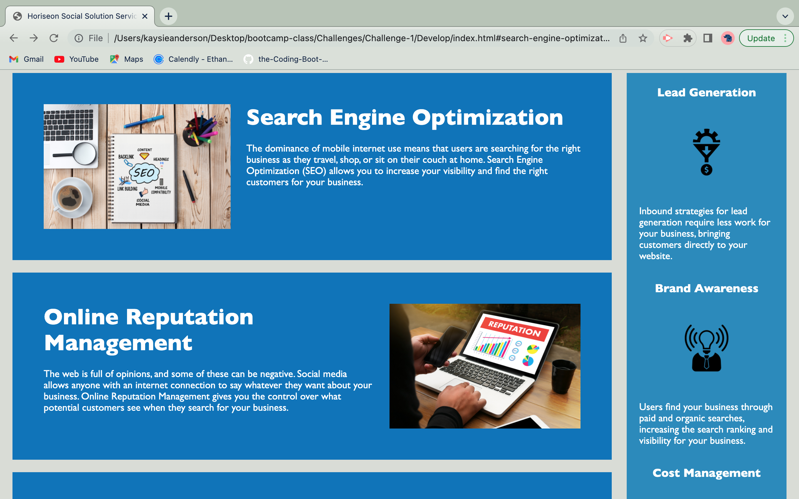

# Horiseon Social Solution Services, Inc

## Purpose

The main motivation for this project was to create a more accessible webpage for those with disabilities. The purpose of the project was to also refactor the existing code by organizing, consolidation, reordering and labeling the content.

## Built With
*HTML
*CSS

## Added Accesibility Attributes

The following depicts two images where alt attributes were added, for greater accesibility. 
 ```md
    
    ```

## Website
file:///Users/kaysieanderson/Desktop/bootcamp-class/Challenges/Challenge-1/Develop/index.html

## Contribution
Created by Kaysie Anderson

### (copyright) 2019 Horiseon Social Solution Services, Inc


